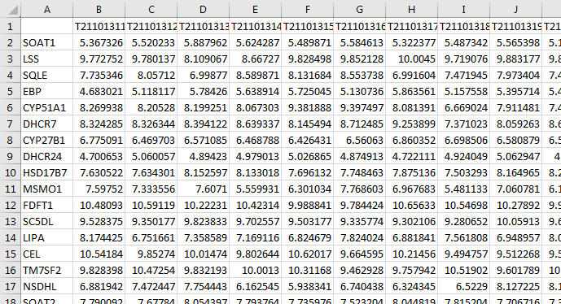
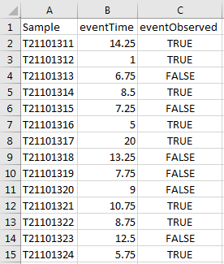

  
```{r setup, include = FALSE}
knitr::opts_chunk$set(collapse = TRUE,
                      cache = FALSE,
                      comment = "#>")
```

# Overview
This vignette is the second chapter in the "Pathway Significance Testing with `pathwayPCA`" workflow. This vignette will discuss importing Gene Matrix Transposed (`.gmt`) [gene set files](https://software.broadinstitute.org/cancer/software/gsea/wiki/index.php/Data_formats#GMT:_Gene_Matrix_Transposed_file_format_.28.2A.gmt.29) to a list object with class `pathwaySet` with the `read_gmt` function. Also, we will discuss importing assay and response data, and how to make your assay data [tidy](https://www.jstatsoft.org/article/view/v059i10). For our pathway analysis to be meaningful, we need gene expression data (from a microarray or something similar), corresponding subject information (such as weight, type of cancer, or survival time and censoring indicator), and a gene set list.

### Outline
Before we move on, we will outline our steps. After reading this vignette, you should be able to

1. Import a `.gmt` file and save the gene sets therein as a `pathwaySet` object using the `read_gmt` function.
2. Import an assay `.csv` file with the `read_csv` function from the `readr` package, and transpose this data frame into "tidy" form with the `transpose_assay` function.
3. Import a subject information `.csv` file, and join (merge) it to the assay data frame with the `inner_join` function from the `dplyr` package.

First, load the `pathwayPCA` package and the [`tidyverse` package suite](https://www.tidyverse.org/). If you don't have the `tidyverse` package suite, install that first.
```{r packageLoad}
# install.packages("tidyverse")
library(tidyverse)
library(pathwayPCA)
```

*******************************************************************************

</br>

# GMT Files
GMT files are one form of gene set file officially recognized by the Gene Set Enrichment Analysis committee of the Broad Institute. These Molecular Signatures Database (MSigDB) GMT files can be downloaded from the [MSigDB Collections](http://software.broadinstitute.org/gsea/msigdb/collections.jsp) page. 

### GMT Format Description
GMT-formatted files follow a very specific set of rules:

1. Each row of the file represents a gene set, and only one gene set is allowed per line.
2. The first entry in each row is the gene set name. Eg. `"KEGG_STEROID_BIOSYNTHESIS"`
3. The second entry in each row is a brief description of the gene set. Eg. `"http://www.broadinstitute.org/gsea/msigdb/cards/KEGG_STEROID_BIOSYNTHESIS"`
4. The third to the last entry on each row are the genes in the gene set. Eg. `"SOAT1"  "LSS" "SQLE"  "EBP" "CYP51A1" "DHCR7" "CYP27B1" "DHCR24"  "HSD17B7" "MSMO1" "FDFT1" "SC5DL" "LIPA"  "CEL" "TM7SF2"  "NSDHL" "SOAT2"`
5. Each entry in each line is seperated by a tab.

### Importing with the `read_gmt` Function
Based on the clearly-organized `.gmt` data format, we are able to write a very fast function to read `.gmt` files into R. The `read_gmt` function takes in a path specifying where your `.gmt` file is stored, and outputs a list of gene set information.
```{r read_example_gmt, eval = FALSE}
gene_set_ls <- read_gmt("path_to_your_directory/your_file_name.gmt")
```
```{r read_real_gmt, echo = FALSE}
gene_set_ls <- read_gmt("../inst/extdata/c2.cp.v6.0.symbols.gmt")
```

The form of this information must be discussed carefully. This `gene_set_ls` object has class `pathwaySet` and contains the following components:

1. `pathways`: A named list of character vectors. Each character vector should contain a subset of the -Omes measured in your assay data frame. These pathways should not be too short, otherwise we devolve the problem into simply testing individual genes. Therefore, the `pathwayPCA` package requires each pathway to have a minimum of three genes with recorded expressions in the predictor data frame.

**Important**: some protein set lists have proteins markers recorded as character numerics, so make sure the feature names of your assay have an overlap with the gene or protein names in the `pathwaySet` list. Ensure that there is a non-empty overlap between the names in the pathways and the feature names of the assay. Not every feature in your assay data frame will be in a pathway gene set, and not every gene in each pathway will have a measurement in the assay data frame. *However, for meaningful results, there should be a significant overlap between the genes measured in the data frame and the gene names sorted into the pathways.* If your gene set list has very few matching genes in your data frame, then your pathway-based analysis results will be significantly degraded. **Make sure your pathway set and data assay are compatible.**

2. `TERMS`: A character vector the same length as the pathways list with the proper names of the pathways.
3. `GSEA_link`: A character vector the same length as the pathways list with hyperlinks to the MSigDB description card for that pathway.
4. `setsize`: the number of genes originally recorded in each pathway, stored as an integer vector. NOTE: *this information is calculated and added to the pathway set list later, at `Omics`-class object creation.* This information is useful to measure the ratio of the number of genes from each pathway expressed in your assay to the number of genes defined to be in that pathway. This ratio should be very close to 1 for best pathway analysis results.

The object itself has the following structure:
```{r pathwaySet_structure}
gene_set_ls
```

This object will be the list supplied to the `pathwaySet_ls` argument in the `create_OmicsPath`, `create_OmicsSurv`, `create_OmicsReg`, or `create_OmicsCateg` functions.

### Creating Your Own `pathwaySet` List
Additionally, you can create a `pathwaySet` object from scratch with the `create_pathwaySet` function. This may be useful to users who have their pathway information stored in some form other than a `.gmt` file. You must supply a list of -Omes to the `pathways` argument, and the proper names of the pathways to the `TERMS` argument. You could also store any other pertinant pathway information by passing a `<name> = <value>` pair to this function.
```{r create_test_pathwaySet}
myPathways_ls <- list(pathway1 = c("Gene1", "Gene2"),
                      pathway2 = c("Gene3", "Gene4", "Gene5"),
                      pathway3 = "Gene6")
myPathway_names <- c("KEGG_IMPORTANT_PATHWAY_1",
                     "KEGG_IMPORTANT_PATHWAY_2",
                     "SOME_OTHER_PATHWAY")
create_pathwaySet(pathways = myPathways_ls,
                  TERMS = myPathway_names,
                  website = "URL_TO_PATHWAY_CITATION")
```

*******************************************************************************

</br>

# Import and Tidy an Assay Matrix
We assume that the assay data (be it genomic, proteomic, metabolomic, lipidomic, or transcriptomic data) is either in an Excel file or flat text file. For example, your data may look like this:



In this data set, the columns are individual samples, patients, tumors, cell lines, etc. The rows are the -Omic expression measures.


### Import with `readr`
To import these files in `.csv` (comma-separated), `.fwf` (fixed-width), or `.txt` (tab-delimited), we recommend the [`readr` package](https://readr.tidyverse.org/). We would read a `.csv` data file via
```{r read_example_assay, eval = FALSE}
assay_df <- read_csv("path_to_your_directory/your_assay.csv")
```
```{r read_real_assay, echo = FALSE}
# Travis requires relative paths
assay_df <- read_csv("../inst/extdata/ex_assay_subset.csv")
```
You can read fixed-width files with the `read_fwf` function, and general delimited files with `read_delim`. Both of these functions are from the `readr` package. For data in `.xls` or `.xlsx` format, we recommend the [`readxl`](http://readxl.tidyverse.org/) package.

Let's inspect our assay data frame. Note that the gene names were imported as a character column (see the `<chr>` tag at the top of the first column). This data import step stored the row names (the gene names) as the first column, and preserved the column names (sample labels) of the data.
```{r assay_print}
assay_df
```


### Tidy the Assay Data Frame
The assay input to the `pathwayPCA` package must be in [*tidy data*](https://www.jstatsoft.org/article/view/v059i10) format. The "Tidy Data" format requires that each observation be its own row, and each measurement its own column. This means that we must transpose our assay data frame, while preserving the row and column names.

To do this, we can use the `transpose_assay` function. This function takes in a data frame as imported by the `readr` function based on data in a format similar to that shown above: genes are the rows, gene names are the first column, samples are are the stored in the subsequent columns, and all values in the assay (other than the single names column) are numeric.
```{r transpose}
(assayT_df <- transpose_assay(assay_df))
```

This transposed data frame has the gene names as the column names and the sample names as a column of character (`chr`) values. Notice that the data itself is 17 genes measured on 36 samples. Before transposition, we had 37 columns because the feature names were stored in the first column. After transposition, we have 36 rows but 18 columns: the first column stores the sample names. This transposed data frame (after filtering to match the response data) will be supplied to the `assayData_df` argument in the `create_OmicsPath`, `create_OmicsSurv`, `create_OmicsReg`, or `create_OmicsCateg` functions. (*See the [Creating `Omics` Data Objects](https://gabrielodom.github.io/pathwayPCA/articles/Create_Omics_Objects.html) vignette for more information on creating `Omics*`-class objects.*)

### Subsetting a Tidy Data Frame
If ever we need to extract individual components of a tidy data frame, we can use the `assay[row, col]` syntax. If we need entire measurements (columns), then we can call the column by name with the `assay$ColName` syntax. For example,

- If we need the second row of `assayT_df`---corresponding to Sample "T21101312"---then we type
```{r subset_2ndrow}
assayT_df[2, ]
```
- If we need the third column of `assayT_df`---corresponding to Gene "LSS"---then we type
```{r subset_3rdcol}
assayT_df[, 3]
```
- If we need the intersection of these two (the expression level of Gene "LSS" in Sample "T21101312"), then we type
```{r subset_23}
assayT_df[2, 3]
```
- If we need the third column of `assayT_df`, but we want the result back as a vector instead of a data frame, we have to call the column by name:
```{r subset_3rdcol_byname}
assayT_df$LSS
```

*******************************************************************************

</br>

# Import and Join Response Data
We now have an appropriate pathway set list and a tidy -Omics assay data frame. Let's imagine that your response data looks something like this:




We now need to import the response information. We can use the `read_csv` function once again:
```{r read_example_pinfo, eval = FALSE}
pInfo_df <- read_csv("path_to_your_directory/your_subject_info.csv")
```
```{r read_real_pinfo, echo = FALSE}
pInfo_df <- read_csv("../inst/extdata/ex_pInfo_subset.csv")
```

This data frame has a column for the sample labels (`Sample`) and the response information. In this case, our response is a survival response with an event time and observation indicator.
```{r pInfo}
pInfo_df
```

This `pInfo` data frame has the sample names as a column of character values, just like the transposed assay data frame. This is crucially important for the "joining" step. We can use the `inner_join` function from the `dplyr` library to only retain the rows of the `assayT_df` data frame which have responses in the `pInfo` data frame and vice versa. This way, every response has matching assay predictors, and every recorded assay sample has a matching response. **This requires you to have a *key* column in both data frames with the same name.** If the key column was called "Sample" in the `pInfo_df` data set but "SampleID" in the assay, then the `by` argument should be changed to `c("Sample" = "SampleID")`. It's much nicer to just keep them with the same names, however.
```{r innerJoin}
(joinedExperiment_df <- inner_join(pInfo_df, assayT_df, by = "Sample"))
```

It is vitally important that you check your sample IDs. Obviously the expressed genetic data should pair with the subject information, but **it is your responsibility as the user to confirm that the assay rows match the correct responses.** We can show you the proper methods to check your data, but you are ultimately responsible to use this package properly.

*******************************************************************************

</br>

# Example Tidy Assay and Gene Set
Included in this package, we have a small tidy assay and corresponding gene subset list. We will load and inspect this assay. This data set has 656 gene expression measurements on 250 colon cancer patients. Further notice that the assay and survival response information have already been merged.
```{r tumour_data_load}
data("colonSurv_df")
str(colonSurv_df, list.len = 10)
```

We also have a small list of 15 pathways which correspond to our example colon cancer assay. We have curated this list to include seven significant pathways and eight non-significant pathways.
```{r pathway_list_load}
data("colon_pathwaySet")
colon_pathwaySet
str(colon_pathwaySet$pathways, list.len = 10)
```

The pathway set list and tidy assay (with matched patient response information) are all the information we need to create an `Omics`-class data container. 

*******************************************************************************

</br>

# Review
We now summarize our steps so far. We have

1. Imported a `.gmt` file and saved the gene sets therein as a `pathwaySet` object using the `read_gmt` function.
2. Imported an assay `.csv` file with the `read_csv` function from the `readr` package, and transposed this data frame into "tidy" form with the `transpose_assay` function.
3. Imported a subject information `.csv` file, and joined it to the assay data frame with the `inner_join` function from the `dplyr` package.

Now we are prepared to create our first `Omics`-class object for analysis with either AES-PCA or Supervised PCA. Please read the next vignette: [Creating `Omics` Data Objects](https://gabrielodom.github.io/pathwayPCA/articles/C3-Create_Omics_Objects.html).

